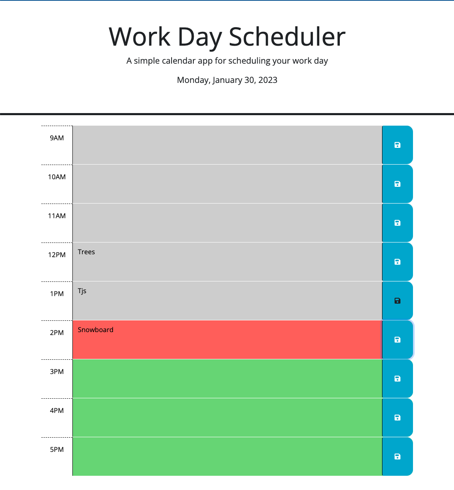

# Work Day Scheduler - Jquery

Built with jQuery + DayJS: Displays a daily calendar based on user's timezone.

## Description

I was inspired to make this application as a way to more easily track the day-to-day tasks that people encounter at work. I'm a big believer in staying organized and using this scheduler as a visual tool to see one's day with a quick glance. The color coding of the hour blocks cooresponds with the user's local time zone, so they can track where they are throughout the day.
I learned a lot about jQuery by working through this project. For being my first full jQuery web app, it was really my first time putting jQuery together all on one page.
My biggest challenge was targeting the correct parent div, based on the key that was stored in local storage.

## Installation

Fork my code through GitHub and you can get started just by using the HTML, CSS files and the JavaScript file.

## Usage

Webpage screenshot below. Normal webpage function and usage. Written using jQuery.

App can be found here:
https://eziegler11.github.io/Work-Day-Scheduler/

## License

MIT License

Copyright (c) 2023 Erich Z.

Permission is hereby granted, free of charge, to any person obtaining a copy
of this software and associated documentation files (the "Software"), to deal
in the Software without restriction, including without limitation the rights
to use, copy, modify, merge, publish, distribute, sublicense, and/or sell
copies of the Software, and to permit persons to whom the Software is
furnished to do so, subject to the following conditions:

The above copyright notice and this permission notice shall be included in all
copies or substantial portions of the Software.

THE SOFTWARE IS PROVIDED "AS IS", WITHOUT WARRANTY OF ANY KIND, EXPRESS OR
IMPLIED, INCLUDING BUT NOT LIMITED TO THE WARRANTIES OF MERCHANTABILITY,
FITNESS FOR A PARTICULAR PURPOSE AND NONINFRINGEMENT. IN NO EVENT SHALL THE
AUTHORS OR COPYRIGHT HOLDERS BE LIABLE FOR ANY CLAIM, DAMAGES OR OTHER
LIABILITY, WHETHER IN AN ACTION OF CONTRACT, TORT OR OTHERWISE, ARISING FROM,
OUT OF OR IN CONNECTION WITH THE SOFTWARE OR THE USE OR OTHER DEALINGS IN THE
SOFTWARE.
